AI Customer Support Agent 🤖
An intelligent, context-aware customer support chatbot powered by Claude (Anthropic). Built with clean OOP architecture in Python, featuring conversation memory, guardrails, and a modular design that mirrors real-world production AI systems.

🚀 Live Demo
Coming soon — deploying to Railway

💡 Why I Built This
Every company deploying AI right now is trying to solve the same problem: how do you make an LLM that actually knows your product, stays on topic, and remembers what was said 3 messages ago?
This project solves all three — without relying on LangChain or any AI framework magic. Everything is built from scratch so I understand exactly what's happening at every layer.

✨ Features
Conversation Memory — Remembers full chat history within a session, automatically trims to prevent context overflow
Guardrails System — Detects and blocks off-topic questions before they ever hit the API, saving cost and keeping the bot focused
Custom Knowledge Base — Inject any product documentation and the agent answers only from that source
Honest Responses — Prompted to say "I don't know" rather than hallucinate answers
Modular Architecture — Swap Claude for GPT or any other LLM by changing one file

🏗️ Architecture
support_agent/
├── models/
│   ├── message.py          # Message blueprint with role, content, timestamp
│   └── conversation.py     # Memory management & history trimming
├── services/
│   ├── llm_client.py       # Anthropic API wrapper
│   ├── prompt_builder.py   # Dynamic system prompt generation
│   └── guardrails.py       # Topic filtering & safety layer
├── data/
│   └── docs/               # Product knowledge base files
└── main.py                 # Entry point & chat loop

🛠️ Tech Stack
Python 3.9
Anthropic Claude API (claude-sonnet-4-6)
python-dotenv for environment management
Flask (coming soon — REST API layer)
React (coming soon — chat UI)

⚙️ Getting Started
1. Clone the repo
git clone https://github.com/yourusername/ai-customer-support-agent
cd ai-customer-support-agent

2. Install dependencies
pip3 install anthropic python-dotenv

3. Add your API key
Create a .env file in the root:
ANTHROPIC_API_KEY=your-key-here

4. Run it
python3 main.py

💬 Example Conversation
=== TechCorp Support Agent ===
Type your question or type 'quit' to exit

YOU: How do I reset my password?
AGENT: To reset your password, click the Forgot Password link on the login page. 
You'll receive an email with reset instructions within a few minutes.

YOU: What if I don't get the email?
AGENT: If you don't receive the reset email, please check your spam or junk folder. 
If it's not there, contact our support team who are available Monday to Friday, 9am–5pm EST.

YOU: What's the weather like?
AGENT: I can only help with questions about our product and services.

🗺️ Roadmap
[x] Core OOP architecture
[x] Conversation memory management
[x] Guardrails & topic filtering
[x] Claude API integration
[ ] Flask REST API wrapper
[ ] React chat UI frontend
[ ] Docker deployment
[ ] Deploy to Railway

🧠 What I Learned
How to architect a production-ready AI application using OOP principles
How conversation history works with LLM APIs and why context management matters
How to implement guardrails to control AI behavior without fine-tuning
How to build modular, swappable components (LLMClient can swap Claude for GPT in one line)

👨‍💻 Author
Chris Sanders
AI Software Engineer
AAS in AI Engineering — Maestro (In Progress)
